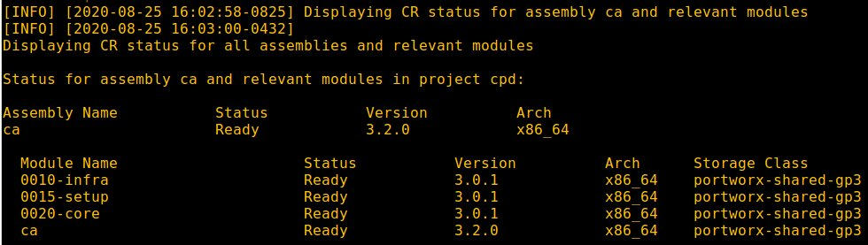
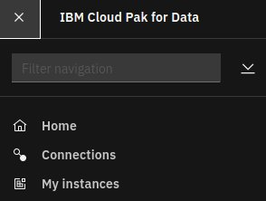
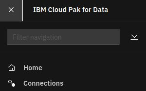
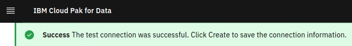
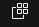

# Install Cognos Analytics

## Hardware requirements

-  One computer which will be called **Installer** that runs Linux or MacOS.

## System requirements

- Have completed  [Prepare for Cognos Analytics](https://github.com/bpshparis/sandbox/blob/master/Prepare-for-Cognos-Analytics.md#prepare-for-cognos-analytics)
- One **WEB server** where following files are available in **read mode**:
  - [ca-3.2.0-x86_64.tar](https://github.com/bpshparis/sandbox/blob/master/Prepare-for-Cognos-Analytics.md#save-cognos-analytics-downloads-to-web-server)

<br>
:checkered_flag::checkered_flag::checkered_flag:
<br>

## Install Cognos Analytics

> :information_source: Commands below are valid for a **Linux/Centos 7**.

> :warning: Some of commands below will need to be adapted to fit Linux/Debian or MacOS .

### Log in OCP

> :warning: Adapt settings to fit to your environment.

> :information_source: Run this on Installer 

```
LB_HOSTNAME="cli-ocp15"
NS="cpd"
```

```
oc login https://$LB_HOSTNAME:6443 -u admin -p admin --insecure-skip-tls-verify=true -n $NS
```

### Copy Cognos Analytics Downloads from web server

> :warning: Adapt settings to fit to your environment.

> :information_source: Run this on Installer 

```
INST_DIR=~/cpd
ASSEMBLY="ca"
VERSION="3.2.0"
ARCH="x86_64"
TAR_FILE="$ASSEMBLY-$VERSION-$ARCH.tar"
WEB_SERVER_CP_URL="http://web/cloud-pak/assemblies"
```

```
[ -d "$INST_DIR" ] && { rm -rf $INST_DIR; mkdir $INST_DIR; } || mkdir $INST_DIR
cd $INST_DIR

mkdir bin && cd bin
wget -c $WEB_SERVER_CP_URL/$TAR_FILE
tar xvf $TAR_FILE
rm -f $TAR_FILE
```

### Push Cognos Analytics images to Openshift registry

> :warning: To avoid network failure, launch installation on locale console or in a screen

> :information_source: Run this on Installer

```
[ ! -z $(command -v screen) ] && echo screen installed || yum install screen -y

pkill screen; screen -mdS ADM && screen -r ADM
```

> :warning: Adapt settings to fit to your environment.

> :information_source: Run this on Installer

```
INST_DIR=~/cpd
ASSEMBLY="ca"
ARCH="x86_64"
VERSION=$(find $INST_DIR/bin/cpd-linux-workspace/assembly/$ASSEMBLY/$ARCH/* -type d | awk -F'/' '{print $NF}')

[ ! -z "$VERSION" ] && echo $VERSION "-> OK" || echo "ERROR: VERSION is not set."
```

```
podman login -u $(oc whoami) -p $(oc whoami -t) $(oc registry info)

$INST_DIR/bin/cpd-linux preloadImages \
--assembly $ASSEMBLY \
--version $VERSION \
--arch $ARCH \
--action push \
--transfer-image-to $(oc registry info)/$(oc project -q) \
--target-registry-password $(oc whoami -t) \
--target-registry-username $(oc whoami) \
--load-from $INST_DIR/bin/cpd-linux-workspace \
--accept-all-licenses
```


### Create Cognos Analytics resources on cluster

> :information_source: Run this on Installer

```
$INST_DIR/bin/cpd-linux adm \
--namespace $(oc project -q) \
--assembly $ASSEMBLY \
--version $VERSION \
--arch $ARCH \
--load-from $INST_DIR/bin/cpd-linux-workspace \
--apply \
--accept-all-licenses
```

### Install Cognos Analytics

> :warning: Adapt settings to fit to your environment.

> :information_source: Run this on Installer

```
SC="portworx-shared-gp3"
INT_REG=$(oc describe pod $(oc get pod -n openshift-image-registry | awk '$1 ~ "image-registry-" {print $1}') -n openshift-image-registry | awk '$1 ~ "REGISTRY_OPENSHIFT_SERVER_ADDR:" {print $2}') && echo $INT_REG
```

```
$INST_DIR/bin/cpd-linux \
--namespace $(oc project -q) \
--assembly $ASSEMBLY \
--version $VERSION \
--arch $ARCH \
--storageclass $SC \
--cluster-pull-prefix $INT_REG/$(oc project -q) \
--load-from $INST_DIR/bin/cpd-linux-workspace \
--accept-all-licenses

```

### Check Cognos Analytics status

> :information_source: Run this on Installer

```
$INST_DIR/bin/cpd-linux status \
--namespace $(oc project -q) \
--assembly $ASSEMBLY \
--arch $ARCH
```



### Configuring the content store for Cognos Analytics

#### Access Cloud Pak for Data web console

> :information_source: Run this on Installer

```
oc get routes | awk 'NR==2 {print "Access the web console at https://" $2}'
```

> :bulb: Login as **admin** using **password** for password 

#### Collect BLUDB details

> :information_source: Run this on Cloud Pak for Data web console



1. From the navigation, select My instances.
2. Collect the following details: 
   - Database name
   - Deployment id
   - Username
   - Password
   - JDBC Connection URL

#### Update BLUDB for Cognos Analytics

##### Log in OCP

> :warning: Adapt settings to fit to your environment.

> :information_source: Run this on Installer

```
LB_HOSTNAME="cli-ocp15"
NS="cpd"
```

```
oc login https://$LB_HOSTNAME:6443 -u admin -p admin --insecure-skip-tls-verify=true -n $NS
```

##### Connect to DB2U pod

> :warning: Adapt settings with what you collected above.

> :information_source: Run this on Installer

```
NAMESPACE="cpd"
DB2USERNAME="user999"
DB2PASSWORD="eJ*4-XLu1Ca-5z*3"
DB2DEPLOYMENTID="db2oltp-1598106739396"
JDBC_URL="jdbc:db2://w1-ocp15.iicparis.fr.ibm.com:32696/BLUDB"
```

```
export CMD="env DB2USERNAME=$DB2USERNAME DB2PASSWORD=$DB2PASSWORD  bash"
oc  exec -ti $DB2DEPLOYMENTID-db2u-0 -n $NAMESPACE -- $CMD
```

##### Update BLUDB for Cognos Analytics

> :information_source: Run this on DB2U pod

```
cd /mnt/blumeta0/home/db2inst1/sqllib
. ./db2profile   
 
db2 CONNECT to BLUDB user $DB2USERNAME using  $DB2PASSWORD 
db2 UPDATE DATABASE CONFIGURATION USING APPLHEAPSZ 1024 DEFERRED; 
db2 UPDATE DATABASE CONFIGURATION USING LOCKTIMEOUT 240 DEFERRED;
db2 CREATE BUFFERPOOL CMDB_08KBP IMMEDIATE SIZE 1000 PAGESIZE 8K;
db2 CREATE BUFFERPOOL CMDB_32KBP IMMEDIATE SIZE 1000 PAGESIZE 32K;
db2 CREATE SYSTEM TEMPORARY TABLESPACE TSN_SYS_CMDB IN DATABASE PARTITION GROUP IBMTEMPGROUP PAGESIZE 32K BUFFERPOOL CMDB_32KBP;
db2 CREATE USER TEMPORARY TABLESPACE TSN_USR_CMDB IN DATABASE PARTITION GROUP IBMDEFAULTGROUP PAGESIZE 8K BUFFERPOOL CMDB_08KBP;
db2 CREATE REGULAR TABLESPACE TSN_REG_CMDB IN DATABASE PARTITION GROUP IBMDEFAULTGROUP PAGESIZE 8K BUFFERPOOL CMDB_08KBP; 
db2 DROP TABLESPACE USERSPACE1;
db2 CREATE SCHEMA db2COGNOS AUTHORIZATION $DB2USERNAME;
db2 ALTER BUFFERPOOL ibmdefaultbp size 49800

exit
```

#### Create the content store connection

> :warning: Adapt settings with what you collected above.

> :information_source: Run this on Cloud Pak for Data web console

```
USERNAME="user999"
PASSWORD="eJ*4-XLu1Ca-5z*3"
HOST="w1-ocp15.iicparis.fr.ibm.com"
PORT="32696"
DATABASE="BLUDB"
JDBC_URL="jdbc:db2://w1-ocp15.iicparis.fr.ibm.com:32696/BLUDB"
```



1. From the navigation, select Connections.
2. Click **New connection**.
3. Enter a connection name.
4. Select **Db2** as **Connection type**.
5. Set **Host** with **$HOST**.
6. Set **Port** with **$PORT**.
7. Set **Database** with **$DATABASE**.
8. Set **Username** with **$USERNAME**.
9. Set **Password** with **$PASSWORD**.
10. Click **Test connection**.



11. Click **Create**.

#### Provisioning the Cognos Analytics service

> :warning: Adapt settings with what you collected above.

> :information_source: Run this on Cloud Pak for Data web console

1. Click the Services icon  from the Cloud Pak for Data web user interface.
2. From the list of services, locate the **Cognos Analytics** service under the **Analytics** category. Click the action menu and click **Provision instance**.
3. Select **portworx-shared-gp3** for **Shared Volume Storage**.
4. Select **content store connection created above** for **Content Storage**.
5. Click **Create**.


#### Monitoring service provisioning

##### Log in OCP

> :warning: Adapt settings to fit to your environment.

> :information_source: Run this on Installer 

```
LB_HOSTNAME="cli-ocp15"
NS="cpd"
```

```
oc login https://$LB_HOSTNAME:6443 -u admin -p admin --insecure-skip-tls-verify=true -n $NS
```

##### Monitoring service provisioning

> :information_source: Run this on Installer 

```
watch -n5 "oc get pvc | grep 'ca' && oc get po | grep 'ca'"
```


<br>
:checkered_flag::checkered_flag::checkered_flag:
<br>

