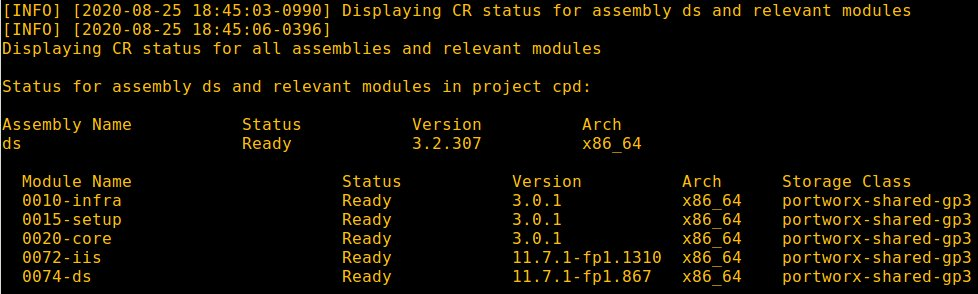

# Install DataStage Edition

## Hardware requirements

-  One computer which will be called **Installer** that runs Linux or MacOS, with 500 MB of local disk space.

## System requirements

- Have completed  [Prepare for DataStage Edition](https://github.com/bpshparis/sandbox/blob/master/Prepare-for-DataStage-Edition.md#prepare-for-datastage-edition)
- One **WEB server** where following files are available in **read mode**:
  - [ds-3.2.307-x86_64.tar](https://github.com/bpshparis/sandbox/blob/master/Prepare-for-DataStage-Edition.md#save-datastage-edition-downloads-to-web-server)

<br>
:checkered_flag::checkered_flag::checkered_flag:
<br>

## Install CDataStage Edition

> :information_source: Commands below are valid for a **Linux/Centos 7**.

> :warning: Some of commands below will need to be adapted to fit Linux/Debian or MacOS .

### Log in OCP

> :warning: Adapt settings to fit to your environment.

> :information_source: Run this on Installer 

```
LB_HOSTNAME="cli-ocp15"
NS="cpd"
```

```
oc login https://$LB_HOSTNAME:6443 -u admin -p admin --insecure-skip-tls-verify=true -n $NS
```

### Copy DataStage Edition Downloads from web server

> :warning: Adapt settings to fit to your environment.

> :information_source: Run this on Installer 

```
INST_DIR=~/cpd
ASSEMBLY="ds"
VERSION="3.2.307"
ARCH="x86_64"
TAR_FILE="$ASSEMBLY-$VERSION-$ARCH.tar"
WEB_SERVER_CP_URL="http://web/cloud-pak/assemblies"
```

```
[ -d "$INST_DIR" ] && { rm -rf $INST_DIR; mkdir $INST_DIR; } || mkdir $INST_DIR
cd $INST_DIR

mkdir bin && cd bin
wget -c $WEB_SERVER_CP_URL/$TAR_FILE
tar xvf $TAR_FILE
rm -f $TAR_FILE
```

### Push DataStage Edition images to Openshift registry

> :warning: To avoid network failure, launch installation on locale console or in a screen

> :information_source: Run this on Installer

```
[ ! -z $(command -v screen) ] && echo screen installed || yum install screen -y

pkill screen; screen -mdS ADM && screen -r ADM
```

> :warning: Adapt settings to fit to your environment.

> :information_source: Run this on Installer

```
INST_DIR=~/cpd
ASSEMBLY="ds"
ARCH="x86_64"
VERSION=$(find $INST_DIR/bin/cpd-linux-workspace/assembly/$ASSEMBLY/$ARCH/* -type d | awk -F'/' '{print $NF}')

[ ! -z "$VERSION" ] && echo $VERSION "-> OK" || echo "ERROR: VERSION is not set."
```

```
podman login -u $(oc whoami) -p $(oc whoami -t) $(oc registry info)

$INST_DIR/bin/cpd-linux preloadImages \
--assembly $ASSEMBLY \
--version $VERSION \
--arch $ARCH \
--action push \
--transfer-image-to $(oc registry info)/$(oc project -q) \
--target-registry-password $(oc whoami -t) \
--target-registry-username $(oc whoami) \
--load-from $INST_DIR/bin/cpd-linux-workspace \
--accept-all-licenses
```


### Create DataStage Edition resources on cluster

> :information_source: Run this on Installer

```
$INST_DIR/bin/cpd-linux adm \
--namespace $(oc project -q) \
--assembly $ASSEMBLY \
--version $VERSION \
--arch $ARCH \
--load-from $INST_DIR/bin/cpd-linux-workspace \
--apply \
--accept-all-licenses
```

>:bulb: Check **wdp-db2-sa** and **wkc-iis-sa** services account have been created

```
oc get sa
```


### Install DataStage Edition

> :warning: Adapt settings to fit to your environment.

> :information_source: Run this on Installer

```
SC="portworx-shared-gp3"
INT_REG=$(oc describe pod $(oc get pod -n openshift-image-registry | awk '$1 ~ "image-registry-" {print $1}') -n openshift-image-registry | awk '$1 ~ "REGISTRY_OPENSHIFT_SERVER_ADDR:" {print $2}') && echo $INT_REG
OVERRIDE=$INST_DIR/ds-override.yaml
```

```
cat > $OVERRIDE << EOF
shared-services:
  kafka:
    volumeClaim:
      overrideStorageClass: true
      storageClassName: "portworx-kafka-sc"

wdp-db2:
  support4kDevice: true
  volumeClaim:
    storageClassName: "portworx-db2-rwo-sc"
    overrideStorageClass: true

xmetarepoVolumeInfo:
  support4kDevice: true
  volumeClaim:
    storageClassName: "portworx-db2-rwo-sc"
    overrideStorageClass: true
EOF
```

```
$INST_DIR/bin/cpd-linux \
--namespace $(oc project -q) \
--assembly $ASSEMBLY \
--version $VERSION \
--arch $ARCH \
--storageclass $SC \
--cluster-pull-prefix $INT_REG/$(oc project -q) \
--load-from $INST_DIR/bin/cpd-linux-workspace \
--override $OVERRIDE \
--accept-all-licenses

```

> :bulb: Check installation progress

```
watch -n5 "oc get pvc | egrep -w 'ds|iis|is|kafka|solr' ; oc get po | egrep -w 'ds|iis|is|kafka|solr'"
```


### Check DataStage Edition status

> :information_source: Run this on Installer

```
$INST_DIR/bin/cpd-linux status \
--namespace $(oc project -q) \
--assembly $ASSEMBLY \
--arch $ARCH
```




<br>
:checkered_flag::checkered_flag::checkered_flag:
<br>

