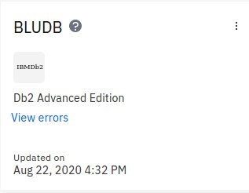
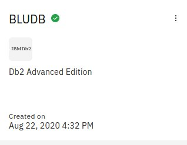

# Install Db2 Warehouse

## Hardware requirements

-  One computer which will be called **Installer** that runs Linux or MacOS, with 500 MB of local disk space.

## System requirements

- Have completed  [Prepare for Db2 Warehouse](https://github.com/bpshparis/sandbox/blob/master/Prepare-for-DB2-Warehouse.md#prepare-for-db2-warehouse)
- One **WEB server** where following files are available in **read mode**:
  - [db2wh-3.0.1-x86_64.tar](https://github.com/bpshparis/sandbox/blob/master/Prepare-for-DB2-Warehouse.md#save-db2-warehouse-downloads-to-web-server)

<br>
:checkered_flag::checkered_flag::checkered_flag:
<br>

## Install Db2 Warehouse

> :information_source: Commands below are valid for a **Linux/Centos 7**.

> :warning: Some of commands below will need to be adapted to fit Linux/Debian or MacOS .

### Log in OCP

> :warning: Adapt settings to fit to your environment.

> :information_source: Run this on Installer 

```
LB_HOSTNAME="cli-ocp15"
NS="cpd"
```

```
oc login https://$LB_HOSTNAME:6443 -u admin -p admin --insecure-skip-tls-verify=true -n $NS
```

### Label worker node for Db2 Warehouse

> :information_source: Run this on Installer 

```
LABEL="\"icp4data=database-db2wh\""
```

```
oc get nodes | awk '$3 ~ "compute|worker" {print "oc label node " $1 " "'$LABEL'" --overwrite"}' | sh
```

>:bulb: Check workers are labelled

```
oc get nodes --show-labels | awk '$3 ~ "compute|worker" {print $1 " -> " $6}'
```

### Copy Db2 Warehouse Downloads from web server

> :warning: Adapt settings to fit to your environment.

> :information_source: Run this on Installer 

```
INST_DIR=~/cpd
ASSEMBLY="db2wh"
VERSION="3.0.1"
ARCH="x86_64"
TAR_FILE="$ASSEMBLY-$VERSION-$ARCH.tar"
WEB_SERVER_CP_URL="http://web/cloud-pak/assemblies"
```

```
[ -d "$INST_DIR" ] && { rm -rf $INST_DIR; mkdir $INST_DIR; }
cd $INST_DIR

mkdir bin && cd bin
wget -c $WEB_SERVER_CP_URL/$TAR_FILE
tar xvf $TAR_FILE
rm -f $TAR_FILE
```

### Push Db2 Warehouse images to Openshift registry

> :warning: To avoid network failure, launch installation on locale console or in a screen

> :information_source: Run this on Installer

```
[ ! -z $(command -v screen) ] && echo screen installed || yum install screen -y

pkill screen; screen -mdS ADM && screen -r ADM
```

> :warning: Adapt settings to fit to your environment.

> :information_source: Run this on Installer

```
INST_DIR=~/cpd
ASSEMBLY="db2wh"
ARCH="x86_64"
VERSION=$(find $INST_DIR/bin/cpd-linux-workspace/assembly/$ASSEMBLY/$ARCH/* -type d | awk -F'/' '{print $NF}')

[ ! -z "$VERSION" ] && echo $VERSION "-> OK" || echo "ERROR: VERSION is not set."
```

```
podman login -u $(oc whoami) -p $(oc whoami -t) $(oc registry info)

$INST_DIR/bin/cpd-linux preloadImages \
--assembly $ASSEMBLY \
--version $VERSION \
--arch $ARCH \
--action push \
--transfer-image-to $(oc registry info)/$(oc project -q) \
--target-registry-password $(oc whoami -t) \
--target-registry-username $(oc whoami) \
--load-from $INST_DIR/bin/cpd-linux-workspace \
--accept-all-licenses
```


### Create Db2 Warehouse resources on cluster

> :information_source: Run this on Installer

```
$INST_DIR/bin/cpd-linux adm \
--namespace $(oc project -q) \
--assembly $ASSEMBLY \
--version $VERSION \
--arch $ARCH \
--load-from $INST_DIR/bin/cpd-linux-workspace \
--apply \
--accept-all-licenses
```

### Install Db2 Warehouse

> :warning: Adapt settings to fit to your environment.

> :information_source: Run this on Installer

```
SC="portworx-shared-gp3"
INT_REG=$(oc describe pod $(oc get pod -n openshift-image-registry | awk '$1 ~ "image-registry-" {print $1}') -n openshift-image-registry | awk '$1 ~ "REGISTRY_OPENSHIFT_SERVER_ADDR:" {print $2}') && echo $INT_REG
```

```
$INST_DIR/bin/cpd-linux \
--namespace $(oc project -q) \
--assembly $ASSEMBLY \
--version $VERSION \
--arch $ARCH \
--storageclass $SC \
--cluster-pull-prefix $INT_REG/$(oc project -q) \
--load-from $INST_DIR/bin/cpd-linux-workspace \
--accept-all-licenses
```

### Check Db2 Warehouse status

> :information_source: Run this on Installer

```
$INST_DIR/bin/cpd-linux status \
--namespace $(oc project -q) \
--assembly $ASSEMBLY \
--arch $ARCH
```


<br>
:checkered_flag::checkered_flag::checkered_flag:
<br>

## Creating BLUDB database

### Access Cloud Pak for Data web console

> :information_source: Run this on Installer

```
oc get routes | awk 'NR==2 {print "Access the web console at https://" $2}'
```

> :bulb: Login as **admin** using **password** for password 

### Creating BLUDB database

> :information_source: Run this on Cloud Pak for Data web console

1.   From the navigation, select Collect > My data.     
2.   Open the Databases tab, which is only visible after you install the database service.
3.   Click Create a database.
4.   Select the database type and version. Click Next. 

>:bulb: Close the **Not enough nodes** error message


5.   Check **Deploy database on dedicated nodes**.
6.   Value for node label should match label added to workers above (e.g. **database-db2oltp**).

7.   Select **portworx-db2-rwx-sc** for System storage. 
8.   Select **portworx-db2-rwo-sc** for User storage. 
9.   Select **portworx-db2-rwx-sc** for Backup storage. 
10.   Click on **Continue with defaults**. 
11.   (optional) Change Display name to **BLUDB**.
12.   Click on **Create**.


### Monitorin BLUDB database creation

#### Log in OCP

> :warning: Adapt settings to fit to your environment.

> :information_source: Run this on Installer 

```
LB_HOSTNAME="cli-ocp15"
NS="cpd"
```

```
oc login https://$LB_HOSTNAME:6443 -u admin -p admin --insecure-skip-tls-verify=true -n $NS
```

#### Monitoring BLUDB database creation

> :information_source: Run this on Installer 

```
watch -n5 "oc get pvc | grep 'db2' && oc get po | grep 'db2'"
```

>:bulb: Don't pay attention to those errors 



### Check BLUDB database status

> :information_source: Run this on Cloud Pak for Data web console

1.   From the navigation, select Collect > My data.     



<br>
:checkered_flag::checkered_flag::checkered_flag:
<br>

