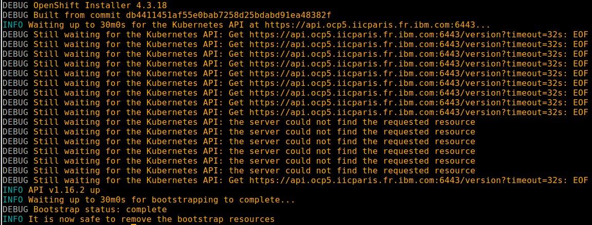
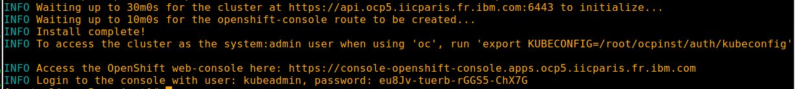
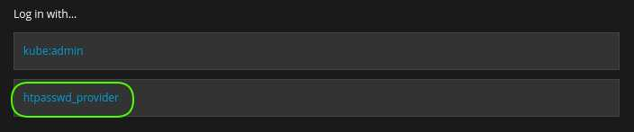

# Installing Redhat Openshift 4 on Bare Metal

This article is *read between lines* of [Installing a cluster on bare metal](https://docs.openshift.com/container-platform/4.3/installing/installing_bare_metal/installing-bare-metal.html).

## Redhat requirements

Be a [Redhat partner](https://partnercenter.redhat.com/Dashboard_page).

Download [Redhat Openshift 4 on Bare Metal material](https://cloud.redhat.com/openshift/install/metal/user-provisioned)

## Hardware requirements

-  One computer which will be called **Installer** that runs Linux or MacOS, with 500 MB of local disk space.
-  One Lenovo **X3550M5** or similar to host **4** virtual machines (bootstrap will be removed after cluster install):

| name                        | role                                              | vcpus  | ram (GB) | storage (GB) | ethernet (10GB) |
| --------------------------- | ------------------------------------------------- | ------ | -------- | ------------ | --------------- |
| m1-ocp5.iicparis.fr.ibm.com | master + etcd                                     | 4      | 16       | 250          | 1               |
| w1-ocp5.iicparis.fr.ibm.com | worker                                            | 16     | 64       | 250          | 1               |
| w2-ocp5.iicparis.fr.ibm.com | worker                                            | 16     | 64       | 250          | 1               |
| w3-ocp5.iicparis.fr.ibm.com | worker                                            | 16     | 64       | 250          | 1               |
| bs-ocp5.iicparis.fr.ibm.com | bootstrap (will be removed after cluster install) | 4      | 16       | 120          | 1               |
| **TOTAL**                   |                                                   | **52** | **208**  | **1000**     | **4**           |


## System requirements

- One **VMware vSphere Hypervisor** [5.5](https://my.vmware.com/en/web/vmware/evalcenter?p=free-esxi5), [6.7](https://my.vmware.com/en/web/vmware/evalcenter?p=free-esxi6) or [7.0](https://my.vmware.com/en/web/vmware/evalcenter?p=free-esxi7) with **ESXi Shell access enabled**. VCenter is NOT required.
- One **DNS server**.
- One **Load balancer**.

| Port      | machines                                                     | Description           |
| --------- | ------------------------------------------------------------ | --------------------- |
| 6443      | m1-ocp5.iicparis.fr.ibm.com<br>bs-ocp5.iicparis.fr.ibm.com   | Kubernetes API server |
| 22623 | m1-ocp5.iicparis.fr.ibm.com<br/>bs-ocp5.iicparis.fr.ibm.com  | Machine Config server |
| 443       | w1-ocp5.iicparis.fr.ibm.com<br/>w2-ocp5.iicparis.fr.ibm.com<br/>w3-ocp5.iicparis.fr.ibm.com | HTTPS traffic         |
| 80        | w1-ocp5.iicparis.fr.ibm.com<br/>w2-ocp5.iicparis.fr.ibm.com<br/>w3-ocp5.iicparis.fr.ibm.com | HTTP traffic          |

- One **WEB server** where following files are available in **read mode**:

  - [Openshift pull secret](https://cloud.redhat.com/openshift/install/pull-secret) saved as pull-secret.txt
  - [Linux](https://mirror.openshift.com/pub/openshift-v4/clients/ocp/latest/openshift-install-linux.tar.gz) or [MacOS](https://mirror.openshift.com/pub/openshift-v4/clients/ocp/latest/openshift-install-mac.tar.gz) OpenShift installer
  - [Linux](https://mirror.openshift.com/pub/openshift-v4/clients/ocp/latest/openshift-client-linux.tar.gz) or [MacOS](https://mirror.openshift.com/pub/openshift-v4/clients/ocp/latest/openshift-client-mac.tar.gz) Openshift command line interface
  - [Red Hat Enterprise Linux CoreOS raw image (*rhcos-4.X.X-x86_64-metal.x86_64.raw.gz*)](https://mirror.openshift.com/pub/openshift-v4/dependencies/rhcos/latest/latest/)
  - [Red Hat Enterprise Linux CoreOS iso image (*rhcos-4.4.3-x86_64-installer.x86_64.iso*)](https://mirror.openshift.com/pub/openshift-v4/dependencies/rhcos/latest/latest/)
  - [Openshift installation configuration file (*install-config.yaml*)](scripts/install-config.yaml)
  - [rhcos.vmx](scripts/rhcos.vmx)
  - [createOCP4Cluster.sh](scripts/createOCP4Cluster.sh)
  - [buildIso.sh](scripts/buildIso.sh)

:checkered_flag::checkered_flag::checkered_flag:

## DNS

> :information_source: Commands below are valid for a **bind9** running on a **Ubuntu 16**

### Set environment

> :warning: Adapt settings to fit to your environment

> :information_source: Run this on DNS

```
DOMAIN=$(cat /etc/resolv.conf | awk '$1 ~ "search" {print $2}') && echo $DOMAIN
IP_HEAD="172.16"
OCP=ocp5
CLI_IP=$IP_HEAD.187.50
M1_IP=$IP_HEAD.187.51
W1_IP=$IP_HEAD.187.54
W2_IP=$IP_HEAD.187.55
W3_IP=$IP_HEAD.187.56
BS_IP=$IP_HEAD.187.59
MZONE=/var/lib/bind/$DOMAIN.hosts
RZONE=/var/lib/bind/$IP_HEAD.rev
```
### Add records to master zone

> :information_source: Run this on DNS

```
cat >> $MZONE << EOF
cli-$OCP.$DOMAIN.   IN      A       $CLI_IP
m1-$OCP.$DOMAIN.   IN      A       $M1_IP
w1-$OCP.$DOMAIN.   IN      A       $W1_IP
w2-$OCP.$DOMAIN.   IN      A       $W2_IP
w3-$OCP.$DOMAIN.   IN      A       $W3_IP
bs-$OCP.$DOMAIN.   IN      A       $BS_IP
api.$OCP.$DOMAIN.  IN      A       $CLI_IP
api-int.$OCP.$DOMAIN.      IN      A       $CLI_IP
apps.$OCP.$DOMAIN. IN      A       $CLI_IP
etcd-0.$OCP.$DOMAIN.       IN      A       $M1_IP
*.apps.$OCP.$DOMAIN.       IN      CNAME   apps.$OCP.$DOMAIN.
_etcd-server-ssl._tcp.$OCP.$DOMAIN.        86400   IN      SRV     0 10 2380 etcd-0.$OCP.$DOMAIN.
EOF
```

### Add records to reverse zone

> :information_source: Run this on DNS

```
cat >> $RZONE << EOF
$(echo $CLI_IP | awk -F. '{print $4 "." $3 "." $2 "." $1}').in-addr.arpa.    IN      PTR     cli-$OCP.$DOMAIN.
$(echo $M1_IP | awk -F. '{print $4 "." $3 "." $2 "." $1}').in-addr.arpa.    IN      PTR     m1-$OCP.$DOMAIN.
$(echo $W1_IP | awk -F. '{print $4 "." $3 "." $2 "." $1}').in-addr.arpa.    IN      PTR     w1-$OCP.$DOMAIN.
$(echo $W2_IP | awk -F. '{print $4 "." $3 "." $2 "." $1}').in-addr.arpa.    IN      PTR     w2-$OCP.$DOMAIN.
$(echo $W3_IP | awk -F. '{print $4 "." $3 "." $2 "." $1}').in-addr.arpa.    IN      PTR     w3-$OCP.$DOMAIN.
$(echo $BS_IP | awk -F. '{print $4 "." $3 "." $2 "." $1}').in-addr.arpa.    IN      PTR     bs-$OCP.$DOMAIN.
EOF
```

### Restart DNS service

> :information_source: Run this on DNS

```
service bind9 restart 
```

### Test master zone

> :information_source: Run this on DNS

```
for host in m1 w1 w2 w3 bs; do echo -n $host-$OCP "-> "; dig @localhost +short $host-$OCP.$DOMAIN; done
```

### Test reverse zone

> :information_source: Run this on DNS

```
for host in m1 w1 w2 w3 bs; do IP=$(dig @localhost +short $host-$OCP.$DOMAIN); echo -n $IP "-> "; dig @localhost +short -x $IP; done
```

### Test alias

> :information_source: Run this on DNS

```
dig @localhost +short *.apps.$OCP.iicparis.fr.ibm.com
```

### Test service

> :information_source: Run this on DNS

```
dig @localhost +short _etcd-server-ssl._tcp.$OCP.$DOMAIN SRV
```

:checkered_flag::checkered_flag::checkered_flag:

<br>

## Load balancer

> :information_source: Commands below are valid for a **haproxy** running on a** Centos 7**.

### Set environment

> :warning: Adapt settings to fit to your environment

> :information_source: Run this on Load Balancer

```
OCP="ocp5"
DOMAIN=$(cat /etc/resolv.conf | awk '$1 ~ "^search" {print $2}') && echo $DOMAIN
LB_CONF="/etc/haproxy/haproxy.cfg" && echo $LB_CONF
```

### :bulb: **Optional**: Remove existing config

> :information_source: Run this on Load Balancer

```
sed -i '/^\s\{1,\}maxconn\s\{1,\}3000$/q' $LB_CONF
```

### Configure load balancer

> :information_source: Run this on Load Balancer

```
cat >> $LB_CONF << EOF

listen stats
    bind :9000
    mode http
    stats enable
    stats uri /

frontend ingress-http
    bind *:80
    default_backend ingress-http
    mode tcp
    option tcplog

backend ingress-http
    balance source
    mode tcp
    server w1-$OCP $(dig +short w1-$OCP.$DOMAIN):80 check
    server w2-$OCP $(dig +short w2-$OCP.$DOMAIN):80 check
    server w3-$OCP $(dig +short w3-$OCP.$DOMAIN):80 check

frontend ingress-https
    bind *:443
    default_backend ingress-https
    mode tcp
    option tcplog

backend ingress-https
    balance source
    mode tcp
    server w1-$OCP $(dig +short w1-$OCP.$DOMAIN):443 check
    server w2-$OCP $(dig +short w2-$OCP.$DOMAIN):443 check
    server w3-$OCP $(dig +short w3-$OCP.$DOMAIN):443 check

frontend openshift-api-server
    bind *:6443
    default_backend openshift-api-server
    mode tcp
    option tcplog

backend openshift-api-server
    balance source
    mode tcp
    server m1-$OCP $(dig +short m1-$OCP.$DOMAIN):6443 check
    server bs-$OCP $(dig +short bs-$OCP.$DOMAIN):6443 check

frontend machine-config-server
    bind *:22623
    default_backend machine-config-server
    mode tcp
    option tcplog

backend machine-config-server
    balance source
    mode tcp
    server m1-$OCP $(dig +short m1-$OCP.$DOMAIN):22623 check
    server bs-$OCP $(dig +short bs-$OCP.$DOMAIN):22623 check

EOF
```

### :bulb: Optional: Disable security

> :information_source: Run this on Load Balancer

```
systemctl stop firewalld &&
systemctl disable firewalld &&
setenforce 0 &&
sed -i -e 's/^SELINUX=\w*/SELINUX=disabled/' /etc/selinux/config
```

### Start  load balancer

> :information_source: Run this on Load Balancer

```
systemctl restart haproxy &&
RC=$(curl -I http://cli-$OCP:9000 | awk 'NR==1 {print $3}') && echo $RC &&
systemctl enable haproxy
```
:checkered_flag::checkered_flag::checkered_flag:


## Prepare installing OCP 4

> :information_source: Commands below are valid for a **Linux/Centos 7**.

> :warning: Some of commands below will need to be adapted to fit Linux/Debian or MacOS .

### Set install-config.yaml

#### Set environment

> :warning: Adapt settings to fit to your environment

> :information_source: Run this on Installer

```
DOMAIN=$(cat /etc/resolv.conf | awk '$1 ~ "^search" {print $2}') && echo $DOMAIN
WEB_SERVER_SOFT_URL="http://web/soft"
INST_DIR=~/ocpinst && echo $INST_DIR
```

#### Set install-config.yaml

> :information_source: Run this on Installer

```
[ -d "$INST_DIR" ] && rm -rf $INST_DIR/* || mkdir $INST_DIR
cd $INST_DIR

wget -c $WEB_SERVER_SOFT_URL/install-config.yaml
sed -i '10s/.*/  replicas: 1/'  install-config.yaml
sed -i "s/\(^baseDomain: \).*$/\1$DOMAIN/" install-config.yaml
sed -i -e '12s/^  name:.*$/  name: '$OCP'/' install-config.yaml

wget $WEB_SERVER_SOFT_URL/pull-secret.txt
SECRET=$(cat pull-secret.txt) && echo $SECRET
sed -i "s/^pullSecret:.*$/pullSecret: '$SECRET'/"  install-config.yaml

[ ! -f ~/.ssh/id_rsa ] && yes y | ssh-keygen -b 4096 -f ~/.ssh/id_rsa -N ""
PUB_KEY=$(cat ~/.ssh/id_rsa.pub) && echo $PUB_KEY
sed -i "s:^sshKey\:.*$:sshKey\: '$PUB_KEY':"  install-config.yaml 
```

### Backup install-config.yaml on web server

#### Set environment

> :warning: Adapt settings to fit to your environment

> :information_source: Run this on Installer

```
WEB_SERVER="web"
WEB_SERVER_PATH="/web/$OCP"
```

### Backup install-config.yaml on web server

> :information_source: Run this on Installer

```
[ -z $(command -v sshpass) ] && yum install -y sshpass || echo "sshpass already installed"

sshpass -e ssh -o StrictHostKeyChecking=no root@$WEB_SERVER "rm -rf $WEB_SERVER_PATH"

sshpass -e ssh -o StrictHostKeyChecking=no root@$WEB_SERVER "mkdir $WEB_SERVER_PATH"

sshpass -e scp -o StrictHostKeyChecking=no install-config.yaml root@$WEB_SERVER:$WEB_SERVER_PATH

sshpass -e ssh -o StrictHostKeyChecking=no root@$WEB_SERVER "chmod -R +r $WEB_SERVER_PATH"
```

### Install Openshift installer, oc and kubectl commands

#### Set environment

> :warning: Adapt settings to fit to your environment

> :information_source: Run this on Installer

```
WEB_SERVER_SOFT_URL="http://web/soft"
INSTALLER_FILE="openshift-install-linux-4.3.18.tar.gz"
CLIENT_FILE="oc-4.3.18-linux.tar.gz"
```

#### Install Openshift installer, oc and kubectl commands

> :information_source: Run this on Installer

```
cd $INST_DIR

wget -c $WEB_SERVER_SOFT_URL/$INSTALLER_FILE
tar xvzf $INSTALLER_FILE

wget -c $WEB_SERVER_SOFT_URL/$CLIENT_FILE
tar -xvzf $CLIENT_FILE -C $(echo $PATH | awk -F":" 'NR==1 {print $1}')
```

### Create manifest and ignition files

> :warning: You have to be on line to execute this step.

> :information_source: Run this on Installer 

```
cd $INST_DIR

./openshift-install create manifests --dir=$PWD
sed -i 's/mastersSchedulable: true/mastersSchedulable: false/' manifests/cluster-scheduler-02-config.yml

./openshift-install create ignition-configs --dir=$PWD
```

### Make ignition files and RHCOS image available on web server

#### Set environment

> :warning: Adapt settings to fit to your environment

> :information_source: Run this on Installer

```
WEB_SERVER="web"
WEB_SERVER_PATH="/web/$OCP"
RHCOS_IMG_PATH="/web/img/rhcos-4.4.3-x86_64-metal.x86_64.raw.gz"
```

#### Make ignition files and RHCOS image available on web server

> :information_source: Run this on Installer

```
cd $INST_DIR

sshpass -e scp -o StrictHostKeyChecking=no *.ign root@$WEB_SERVER:$WEB_SERVER_PATH

sshpass -e ssh -o StrictHostKeyChecking=no root@$WEB_SERVER "ln -s $RHCOS_IMG_PATH $WEB_SERVER_PATH"

sshpass -e ssh -o StrictHostKeyChecking=no root@web "chmod -R +r /web/$OCP"
```

### Customize RHCOS boot iso

:bulb: The trick is to automate what's explained [here](https://docs.openshift.com/container-platform/4.5/installing/installing_bare_metal/installing-bare-metal.html#installation-user-infra-machines-static-network_installing-bare-metal)

#### Set environment

> :warning: Adapt settings to fit to your environment.

> :information_source: Run this on Installer

```
WEB_SERVER_ISO_URL="http://web/iso"
RHCOS_ISO_FILE="rhcos-4.4.3-x86_64-installer.x86_64.iso"
ISO_PATH="/media/iso"
RW_ISO_PATH="/media/isorw"
WEB_SERVER_SOFT_URL="http://web/soft"
TEST_ISO_PATH="/media/test"
ESX_SERVER="ocp5"
ESX_ISO_PATH="/vmfs/volumes/datastore1/iso"
```

#### Prepare RHCOS boot iso customization

> :information_source: Run this on Installer

```
wget -c $WEB_SERVER_ISO_URL/$RHCOS_ISO_FILE

[ ! -d $ISO_PATH ] && mkdir $ISO_PATH 

while [ ! -z "$(ls -A $ISO_PATH)" ]; do umount $ISO_PATH; sleep 2; done

mount -o loop $RHCOS_ISO_FILE $ISO_PATH

[ ! -d $RW_ISO_PATH ] && mkdir $RW_ISO_PATH || rm -rf $RW_ISO_PATH/*
```

#### Customize RHCOS boot iso 

> :information_source: Run this on Installer 

```
[ -z $(command -v mkisofs) ] && yum install -y genisoimage || echo -e mkisofs installed
wget -c $WEB_SERVER_SOFT_URL/buildIso.sh
```

> :warning:  Before proceeding, adapt settings in **buildIso.sh**  to fit to your environment.
>
> - **OCP**
> - **WEB_SRV_URL**
> - **RAW_IMG_URL**
> - **DNS**
> -  **DOMAIN**
> -  **IF**
> - **MASK**
> - **GATEWAY**
> -  **ISO_PATH**
> - **RW_ISO_PATH** 
> - **ISO_CFG**

> :information_source: Run this on Installer 

```
chmod +x buildIso.sh
./buildIso.sh

while [ ! -z "$(ls -A $ISO_PATH)" ]; do umount $ISO_PATH; sleep 2; done
rmdir $ISO_PATH
rm -rf $RW_ISO_PATH
```

#### Check RHCOS boot iso

> :information_source: Run this on Installer 

```
[ ! -d $TEST_ISO_PATH ] && mkdir $TEST_ISO_PATH

for iso in $(ls *.iso); do
    echo $iso
    mount -o loop $iso $TEST_ISO_PATH
    grep 'ip=' $TEST_ISO_PATH/isolinux/isolinux.cfg
    sleep 2
    umount $TEST_ISO_PATH
done

while [ ! -z "$(ls -A $TEST_ISO_PATH)" ]; do umount $TEST_ISO_PATH; sleep 2; done

rmdir $TEST_ISO_PATH
```

#### Make RHCOS boot iso files available on ESX server

> :information_source: Run this on Installer

```
sshpass -e ssh -o StrictHostKeyChecking=no root@$ESX_SERVER "rm -rf $ESX_ISO_PATH/*-$OCP.iso"

sshpass -e scp -o StrictHostKeyChecking=no *-$OCP.iso root@$ESX_SERVER:/$ESX_ISO_PATH

sshpass -e ssh -o StrictHostKeyChecking=no root@$ESX_SERVER "chmod -R +r $ESX_ISO_PATH"
```
:checkered_flag::checkered_flag::checkered_flag:


## Create Cluster

### Set environment

> :warning: Adapt settings to fit to your environment.

> :information_source: Run this on ESX

```
WEB_SERVER_SOFT_URL="http://web/soft"
WEB_SERVER_VMDK_URL="http://web/vmdk"
VMDK_PATH="/vmfs/volumes/datastore1/vmdk/"
```

### Download necessary stuff

> :information_source: Run this on ESX

```
wget -c $WEB_SERVER_SOFT_URL/createOCP4Cluster.sh
wget -c $WEB_SERVER_VMDK_URL/rhcos.vmx -P $VMDK_PATH
```

### Create cluster nodes

> :bulb: Thanks to ESX VNC integrated server, bootstrap process will be monitor able.<br>
> Change default settings in **createOCP4Cluster.sh** if needed.
>
> -  BOOTSTRAP_VNC_PORT="**5909**"
> -  MASTER_1ST_VNC_PORT="**5901**"
> -  WORKER_1ST_VNC_PORT="**5904**"
> -  VNC_PWD="**spcspc**"

>:warning:  Before proceeding, adapt settings in **createOCP4Cluster.sh** to fit to your environment.
>
>- **OCP**
>- **DATASTORE**
>- **VMS_PATH**
>-  **ISO_PATH** 
>-  **VMX**

> :information_source: Run this on ESX

```
chmod +x ./createOCP4Cluster.sh
./createOCP4Cluster.sh
```

:checkered_flag::checkered_flag::checkered_flag:


## Make a BeforeInstallingOCP snapshot

### Stop cli

> :information_source: Run this on ESX

```
PATTERN="cli"
```

```
vim-cmd vmsvc/getallvms | awk '$2 ~ "'$PATTERN'" && $1 !~ "Vmid" {print "vim-cmd vmsvc/power.shutdown " $1}' | sh

watch -n 10 vim-cmd vmsvc/getallvms | awk '$2 ~ "'$PATTERN'" && $1 !~ "Vmid" {print "vim-cmd vmsvc/power.getstate " $1}' | sh
```

> :bulb: Leave watch with **Ctrl + c** when everyone is **powered off**

### Make snapshot

> :information_source: Run this on ESX

```
PATTERN="[mw][1-5]|cli|bs"
```

```
vim-cmd vmsvc/getallvms | awk '$2 ~ "'$PATTERN'" && $1 !~ "Vmid" {print "vim-cmd vmsvc/snapshot.create " $1 " '$SNAPNAME' "}' | sh
```

:checkered_flag::checkered_flag::checkered_flag:

## Start cluster nodes

### Install a vncviewer to monitor cluster nodes

Download and install a  [vnc viewer](https://www.tightvnc.com/download.php) on ** your device **

> :information_source: Run this on your device

```
yum install -y tigervnc
```

> :warning: **VNCPWD** have to match **RemoteDisplay.vnc.password** in **rhcos.vmx**

> :information_source: Run this on your device

```
VNCPWD="spcspc"
```

```
[ -z $(command -v vncpasswd) ] && yum install -y tigervnc-server-minimal || echo "vncpasswd already installed"
echo $VNCPWD | vncpasswd -f > ~/.vnc/passwd
```

### Start cluster nodes

#### Enable VNC on ESX

> :warning: For VNC to work run this on ESX:

> :information_source: Run this on ESX

```
esxcli network firewall ruleset set -e true -r gdbserver
```

#### Start cluster nodes

> :information_source: Run this on ESX

```
PATTERN="[mw][1-5]|cli|bs"
```

```
vim-cmd vmsvc/getallvms | awk '$2 ~ "'$PATTERN'" && $1 !~ "Vmid" {print "vim-cmd vmsvc/power.on " $1}' | sh
```

### Monitor cluster nodes

> :warning:  Next commands will only work if you kept **BOOTSTRAP_VNC_PORT="5909"**, 
**MASTER_1ST_VNC_PORT="5901"** and **WORKER_1ST_VNC_PORT="5904"** when you created cluster nodes with running **createOCP4Cluster.sh**.

#### Monitor bootstrap

> :information_source: Run this on your device

```
ESX_SERVER="ocp5"
```

```
xtightvncviewer -compresslevel 9 -passwd ~/.vnc/passwd $ESX_SERVER:9
```

#### Monitor master

> :information_source: Run this on your device

```
ESX_SERVER="ocp5"
```

```
xtightvncviewer -compresslevel 9 -passwd ~/.vnc/passwd $ESX_SERVER:1
```

#### Monitor worker 1

> :information_source: Run this on your device

```
ESX_SERVER="ocp5"
```

```
xtightvncviewer -compresslevel 9 -passwd ~/.vnc/passwd $ESX_SERVER:4
```

#### Monitor worker 2

> :information_source: Run this on your device

```
ESX_SERVER="ocp5"
```

```
xtightvncviewer -compresslevel 9 -passwd ~/.vnc/passwd $ESX_SERVER:5
```

#### Monitor worker 3

> :information_source: Run this on your device

```
ESX_SERVER="ocp5"
```

```
xtightvncviewer -compresslevel 9 -passwd ~/.vnc/passwd $ESX_SERVER:6
```
:checkered_flag::checkered_flag::checkered_flag:


## Install OCP

### Launch OCP installation

> :bulb: To avoid network failure, launch installation on **locale console** or in a **screen**

> :information_source: Run this on Cli

```
[ ! -z $(command -v screen) ] && echo screen installed || yum install screen -y

pkill screen; screen -mdS ADM && screen -r ADM
```

### Launch wait-for-bootstrap-complete playbook

> :information_source: Run this on Cli

```
INST_DIR=~/ocpinst
```

```
cd $INST_DIR

> ~/.ssh/known_hosts
eval "$(ssh-agent -s)"
ssh-add ~/.ssh/id_rsa

./openshift-install --dir=$PWD wait-for bootstrap-complete --log-level=debug
```

<br>

:hourglass_flowing_sand: :smoking::coffee::smoking::coffee::smoking::coffee::smoking: :coffee: :hourglass_flowing_sand: :beer::beer::beer::pill:  :zzz::zzz: :zzz::zzz: :zzz::zzz::hourglass_flowing_sand: :smoking::coffee: :toilet: :shower: :smoking: :coffee::smoking: :coffee: :smoking: :coffee: :hourglass: 

<br>

>:bulb: Leave screen with **Ctrl + a + d**

>:bulb: Come back with **screen -r ADM**

>:bulb: bootstrap complete output



> :bulb: If something went wrong run a gather bootstrap

```
INST_DIR=~/ocpinst
BS_IP="172.16.187.59"
M1_IP="172.16.187.51"
```

```
cd $INST_DIR
./openshift-install gather bootstrap --bootstrap $BS_IP --key ~/.ssh/id_rsa --master "$M1_IP"
```

> and revert to [BeforeInstallingOCP snapshot](#revert-to-beforeInstallingocp-snapshot)

### Launch wait-for-install-complete playbook

> :information_source: Run this on Cli

```
INST_DIR=~/ocpinst
```

```
cd $INST_DIR
./openshift-install --dir=$PWD wait-for install-complete
```

<br>

:hourglass_flowing_sand: :smoking::coffee::smoking::coffee::smoking::coffee::smoking: :coffee: :hourglass_flowing_sand: :beer::beer::beer::pill:  :zzz::zzz: :zzz::zzz: :zzz::zzz::hourglass_flowing_sand: :smoking::coffee: :toilet: :shower: :smoking: :coffee::smoking: :coffee: :smoking: :coffee: :hourglass: 

<br>

>:bulb: Leave screen with **Ctrl + a + d**

>:bulb: Come back with **screen -r ADM**

>:bulb: install complete output



> :bulb: If something went wrong have a look at **~/$INST_DIR/.openshift_install.log** and revert to [BeforeInstallingOCP snapshot](#revert-to-beforeInstallingocp-snapshot).

:checkered_flag::checkered_flag::checkered_flag:


## Revert to BeforeInstallingOCP snapshot

### Stop cli

> :information_source: Run this on ESX

```
PATTERN="cli"
```

```
vim-cmd vmsvc/getallvms | awk '$2 ~ "'$PATTERN'" && $1 !~ "Vmid" {print "vim-cmd vmsvc/power.shutdown " $1}' | sh

watch -n 10 vim-cmd vmsvc/getallvms | awk '$2 ~ "'$PATTERN'" && $1 !~ "Vmid" {print "vim-cmd vmsvc/power.getstate " $1}' | sh
```

> :bulb: Leave watch with **Ctrl + c** when everyone is **powered off**

### Power off cluster

> :information_source: Run this on ESX

```
PATTERN="[mw][1-5]|bs"
```

```
vim-cmd vmsvc/getallvms | awk '$2 ~ "'$PATTERN'" && $1 !~ "Vmid" {print "vim-cmd vmsvc/power.off " $1}' | sh

watch -n 10 vim-cmd vmsvc/getallvms | awk '$2 ~ "'$PATTERN'" && $1 !~ "Vmid" {print "vim-cmd vmsvc/power.getstate " $1}' | sh
```

> :bulb: Leave watch with **Ctrl + c** when everyone is **powered off**

### Revert snapshot

> :information_source: Run this on ESX

```
PATTERN="[mw][1-5]|bs|cli"
SNAPNAME="BeforeInstallingOCP"
```

```
for vmid in $(vim-cmd vmsvc/getallvms | awk 'NR>1 && $2 ~ "'$PATTERN'" {print $1}'); do vim-cmd vmsvc/snapshot.get $vmid | grep -A 1 'Snapshot Name\s\{1,\}: '$SNAPNAME | awk -F' : ' 'NR>1 {print "vim-cmd vmsvc/snapshot.revert "'$vmid'" " $2 " suppressPowerOn"}' | sh; done
```

<br>

:checkered_flag::checkered_flag::checkered_flag:

## Post install OCP

### Create an admin user with  cluster-admin role

> :information_source: Run this on Cli

```
INST_DIR=~/ocpinst
```

```
export KUBECONFIG=$INST_DIR/auth/kubeconfig
oc whoami
```
>:bulb: Command above should return **system:admin**

```
cd $INST_DIR
[ -z $(command -v htpasswd) ] && yum install -y httpd-tools || echo "htpasswd already installed"

htpasswd -c -B -b admin.htpasswd admin admin                     

oc create secret generic admin-secret --from-file=htpasswd=$INST_DIR/admin.htpasswd  -n openshift-config

oc apply -f - << EOF
apiVersion: config.openshift.io/v1
kind: OAuth
metadata:
  name: cluster
spec:
  identityProviders:
  - name: htpasswd_provider 
    mappingMethod: claim 
    type: HTPasswd
    htpasswd:
      fileData:
        name: admin-secret
  tokenConfig:
    accessTokenMaxAgeSeconds: 31536000         
EOF

sleep 10
oc adm policy add-cluster-role-to-user cluster-admin admin
```


### Login to cluster

> :information_source: Run this on Cli

```
oc login https://cli-$OCP:6443 -u admin -p admin --insecure-skip-tls-verify=true

oc get nodes
```

### Set etcd-quorum-guard to unmanaged state

> :information_source: Run this on Cli

```
oc patch clusterversion/version --type='merge' -p "$(cat <<- EOF
spec:
  overrides:
    - group: apps/v1
      kind: Deployment
      name: etcd-quorum-guard
      namespace: openshift-machine-config-operator
      unmanaged: true
EOF
)"
```

### Downscale etcd-quorum-guard to one

> :information_source: Run this on Cli

```
oc scale --replicas=1 deployment/etcd-quorum-guard -n openshift-machine-config-operator
```

### Setup image-registry to use ephemeral storage

> :information_source: Run this on Cli

```
oc patch configs.imageregistry.operator.openshift.io cluster --type merge --patch '{"spec":{"storage":{"emptyDir":{}}}}'

oc patch configs.imageregistry.operator.openshift.io cluster --type merge --patch '{"spec":{"managementState":"Managed"}}'
```

>:bulb: Wait until the image-registry operator completes the update before using the registry.

### Test Environment

> :information_source: Run this on Cli

```
oc new-project validate

oc new-app django-psql-example

sleep 10

oc logs -f bc/django-psql-example
```

>:bulb: Wait until **Successfully pushed image-registry.openshift-image-registry.svc:5000/validate/django-psql-example**

```
oc get routes | awk 'NR>1 {print "\nTo access your application, Visit url:\n"$2}'
```

### Get web console url and login

> :information_source: Run this on Cli

```
oc get route -n openshift-console | awk 'NR>1 && $1 ~ "console" {print "\nWeb Console is available with htpasswd_provider as admin with admin as password at:\nhttps://"$2}'
```

>:bulb: Login with htpasswd_provider



:checkered_flag::checkered_flag::checkered_flag:

### Remove bootstrap

> :information_source: Run this on ESX

```
PATTERN="bs"
```

```
vim-cmd vmsvc/getallvms | awk '$2 ~ "'$PATTERN'" && $1 !~ "Vmid" {print "vim-cmd vmsvc/power.off " $1}' | sh

sleep 10

vim-cmd vmsvc/getallvms | awk '$2 ~ "'$PATTERN'" && $1 !~ "Vmid" {print "vim-cmd vmsvc/destroy " $1}' | sh
```

### Remove bootstrap from load balancer

> :information_source: Run this on Cli

```
LB_CONF="/etc/haproxy/haproxy.cfg" && echo $LB_CONF
```

```
sed -i 's/\(server bs-*\)/# \1/g' $LB_CONF
systemctl restart haproxy
```


## Make a OCPInstalled snapshot

### Stop workers

> :information_source: Run this on ESX

```
PATTERN="[w][1-5]"
```

```
vim-cmd vmsvc/getallvms | awk '$2 ~ "'$PATTERN'" && $1 !~ "Vmid" {print "vim-cmd vmsvc/power.shutdown " $1}' | sh

watch -n 10 vim-cmd vmsvc/getallvms | awk '$2 ~ "'$PATTERN'" && $1 !~ "Vmid" {print "vim-cmd vmsvc/power.getstate " $1}' | sh
```

> :bulb: Leave watch with **Ctrl + c** when everyone is **powered off**

### Stop masters and cli

> :information_source: Run this on ESX

```
PATTERN="[m][1-5]|cli"
```

```
vim-cmd vmsvc/getallvms | awk '$2 ~ "'$PATTERN'" && $1 !~ "Vmid" {print "vim-cmd vmsvc/power.shutdown " $1}' | sh

watch -n 10 vim-cmd vmsvc/getallvms | awk '$2 ~ "'$PATTERN'" && $1 !~ "Vmid" {print "vim-cmd vmsvc/power.getstate " $1}' | sh
```

> :bulb: Leave watch with **Ctrl + c** when everyone is **powered off**

### Make snapshot

> :information_source: Run this on ESX

```
PATTERN="[mw][1-5]|cli"
SNAPNAME="OCPInstalled"
```

```
vim-cmd vmsvc/getallvms | awk '$2 ~ "'$PATTERN'" && $1 !~ "Vmid" {print "vim-cmd vmsvc/snapshot.create " $1 " '$SNAPNAME' "}' | sh

vim-cmd vmsvc/getallvms | awk '$2 ~ "'$PATTERN'" && $1 !~ "Vmid" {print "vim-cmd vmsvc/power.on " $1}' | sh
```

:checkered_flag::checkered_flag::checkered_flag:
